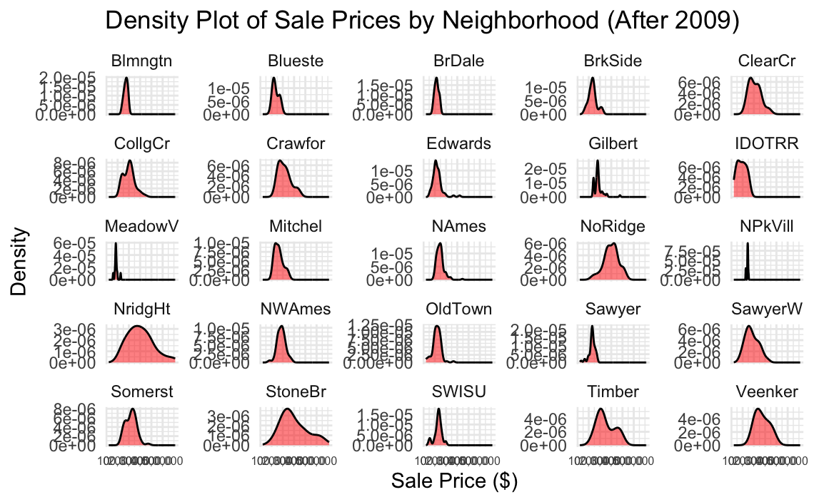
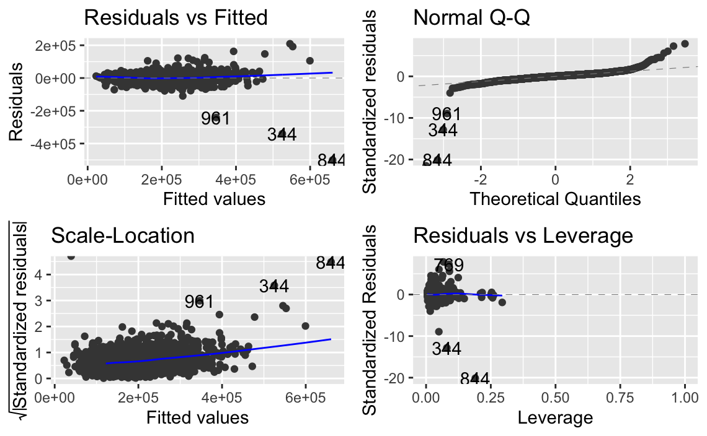
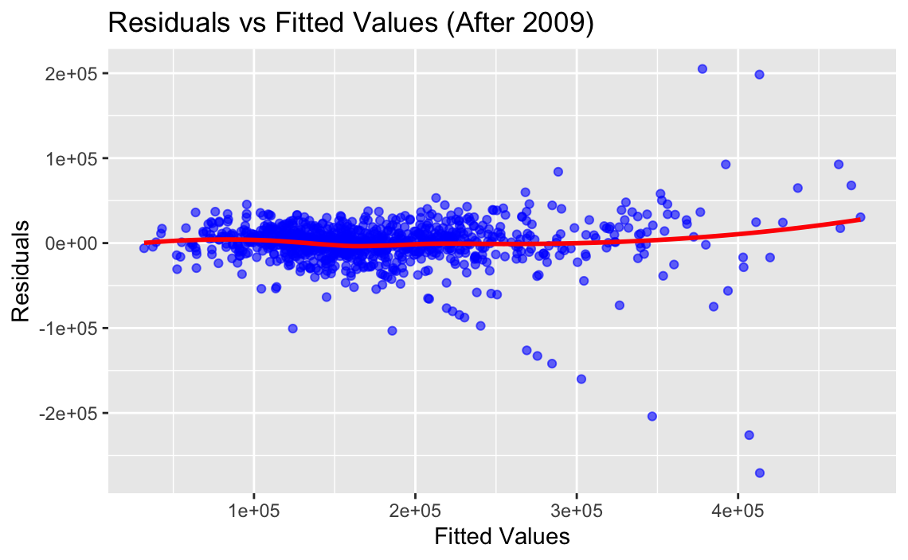
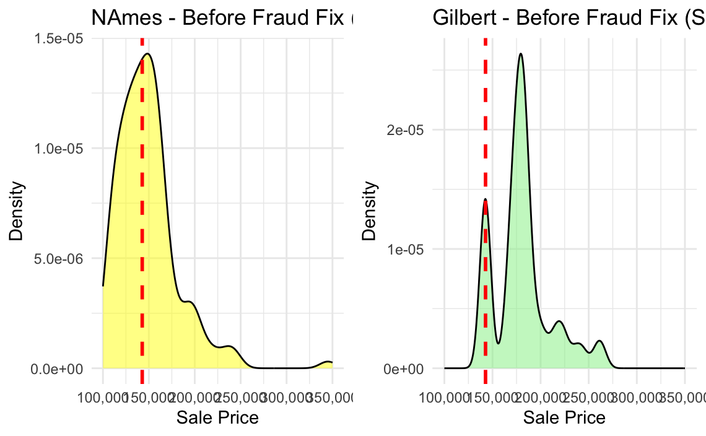
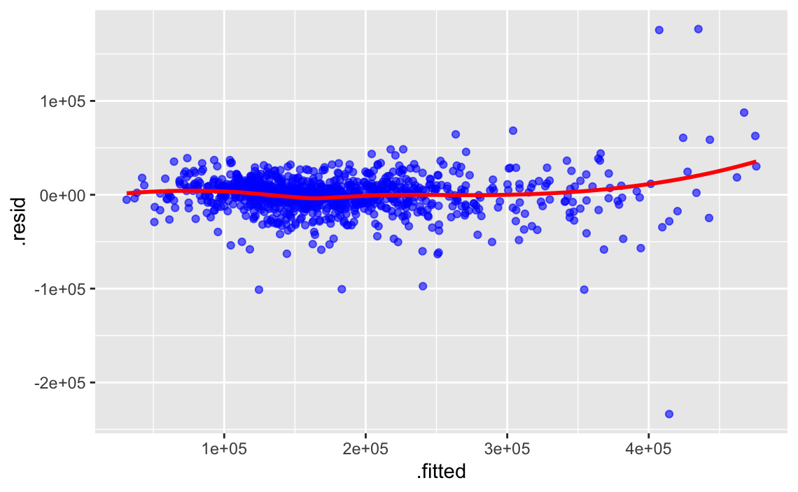
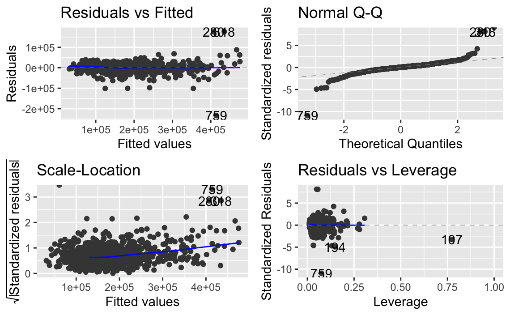
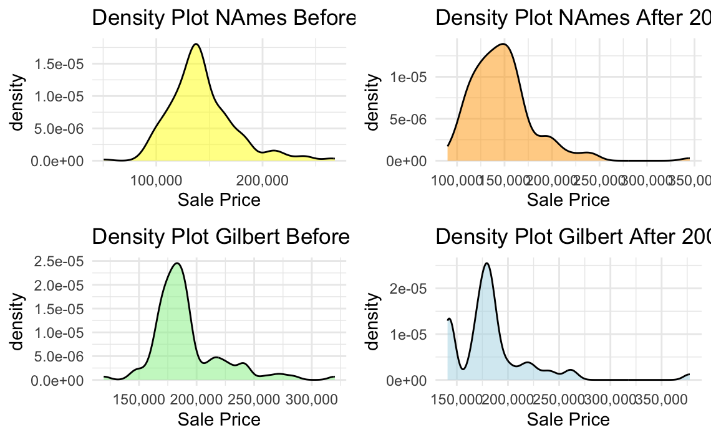
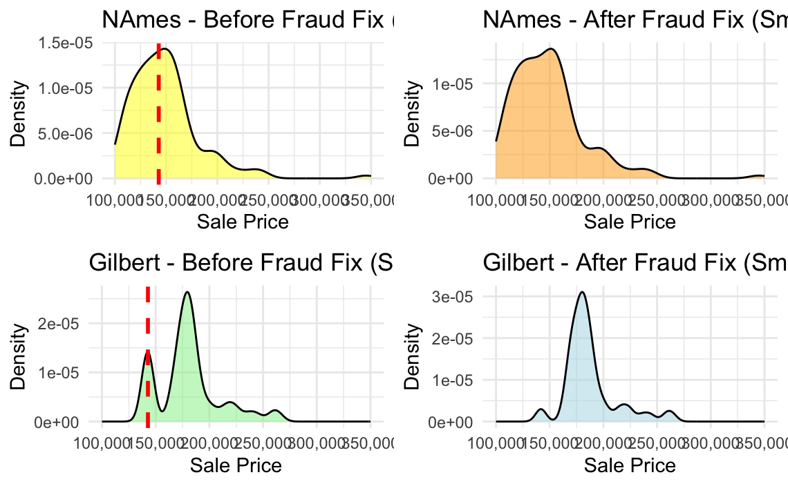
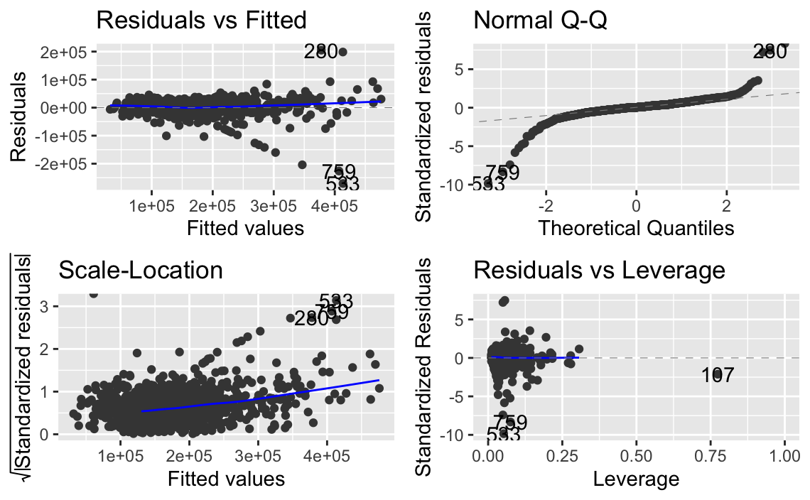

# Housing Price Regression Diagnostics & Outlier Analysis

**Tools:** R · ggplot2 · Linear Regression · Residual Analysis · Regression Diagnostics · dplyr · tidyr

---

## Business Problem

Housing price models can be heavily impacted by outliers, neighborhood variation, and data quality issues. This project analyzes residential housing sale prices to evaluate regression model performance, identify influential observations, and investigate how unusual values affect predictive accuracy.

The objective was to improve understanding of model assumptions, residual behavior, and neighborhood-level pricing distributions through regression diagnostics and exploratory analysis.

---

## Project Approach

- Analyzed residential housing sale price data across multiple neighborhoods
- Explored neighborhood-level price distributions using density plots
- Built linear regression models for housing sale price prediction
- Evaluated:
  - residual behavior
  - leverage points
  - normality assumptions
  - heteroscedasticity
  - influential observations
- Compared model behavior before and after outlier or anomaly adjustments
- Visualized fitted values and diagnostic metrics to assess model quality

---

## Analytical Focus Areas

- Linear regression diagnostics
- Residual analysis
- Outlier detection
- Leverage analysis
- Housing market segmentation
- Neighborhood-level price distributions
- Model assumption testing
- Exploratory data analysis (EDA)

---

## Project Visuals

### Neighborhood Sale Price Density Analysis

Distribution of housing sale prices across neighborhoods after 2009.



---

### Regression Diagnostic Analysis

Diagnostic plots evaluating residuals, leverage, variance patterns, and model assumptions.



---

### Residuals vs Fitted Values

Residual pattern analysis used to assess model fit quality and heteroscedasticity.



---

### Fraud & Outlier Investigation

Exploration of unusual housing price behavior and neighborhood-level anomalies.



---

### Geometric Density Comparisons

Neighborhood distribution comparisons before and after anomaly adjustments.



---

### Leverage & Influence Analysis

Identification of high-leverage observations and influential regression points.



---

### Additional Neighborhood Density Analysis

Comparison of housing density distributions before and after adjustments.



---

### Neighborhood Distribution Analysis

Focused analysis of NAmes and Gilbert housing sale price distributions.



---

### Residual Diagnostic Evaluation

Residual diagnostics used to evaluate model assumption validity and fit behavior.



---

## Repository Structure

```text
data/        -> raw or processed housing datasets
Images/      -> regression and diagnostic visualizations
notebooks/   -> analytical notebooks and R workflows
reports/     -> exported reports and project outputs
```

---

## Files

| File | Description |
|------|-------------|
| `notebooks/` | Regression analysis and diagnostic workflows |
| `reports/` | Exported project reports and outputs |
| `Images/` | Regression diagnostic and density visualizations |

---
## Portfolio

Portfolio Website: https://cameron-batts.github.io/

GitHub Profile: https://github.com/cameron-batts
